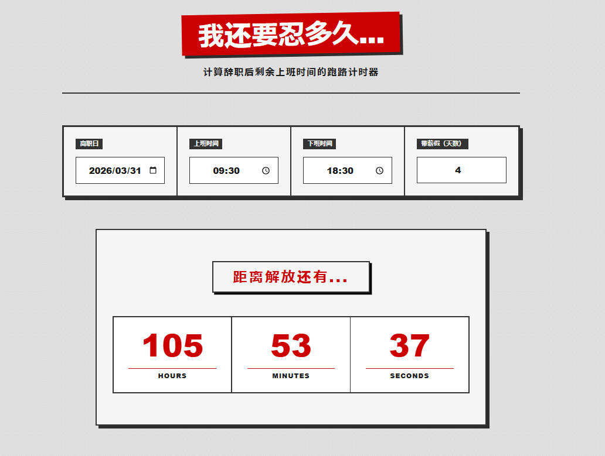

# 跑路计时器 (Resignation Countdown)

[](https://github.com/johnchow-tech/resignation-countdown/actions/workflows/ci-cd.yml)
[](https://playwright.dev/)
[](https://react.dev/)
[](https://vitejs.dev/)

> *“不要计算你在这里度过了多少天，去精准地称量你还需要在这里熬过多少个纯粹的工作小时。”*

一个采用 **粗野主义** 设计美学，基于 React 19 构建的硬核离职倒计时 Web 应用。它彻底摒弃了模糊的“天数”概念，通过降维打击般的算法，为你精准计算出扣除周末、非工作时间以及带薪假（PTO）后，**绝对剩余的纯工作小时数**。

### 🔗 在线体验 (Live Demo)
👉 **[点击这里访问部署在 GitHub Pages 上的生产环境](https://johnchow-tech.github.io/resignation-countdown/)** *(注：项目部署由 GitHub Actions 流水线自动化完成，具有严格的 E2E 质量门禁)*



---

## 🏗️ 核心特性 (Key Features)

### 1. 极致精准的纯工时算法 (Absolute Work-Hour Algorithm)
底层的 `timeCalculator.js` 引擎使用了基于 `Math.max` 和 `setDate()` 的稳健时间轴推进算法：
* **自动剔除周末**：计时器在周六周日会彻底停滞。
* **每日上下班区间裁切**：仅计算 `09:30 - 18:30`（可自定义）区间的毫秒数。
* **PTO 精确抵扣**：输入的带薪假期将完美转换为工时并从总池中扣除。
* **下班冻结状态 (Off-hours Freeze)**：当当前时间处于非工作时段，整个 UI 会进入极其压抑的灰度“冻结”状态（`PRODUCTION HALTED`），计时器停止运转。

### 2. 粗野主义响应式美学 (Brutalist RWD)
* **极简工业调色板**：Kremlin Red（克里姆林红）、Coal Black（煤灰黑）、Concrete Grey（混凝土灰）。
* **流体排版与降维布局**：PC 端为 4 列/3 列的厚重网格；在移动端（<500px）利用 `grid-template-columns: 1fr` 瞬间坍缩为单列重压布局。
* **Grid Gap Border Hack**：利用网格间距底色透出的物理边框，在跨设备断点切换时，边框永远保持像素级完美的刚性切割。

---

## 🛠️ 工程与架构亮点 (Engineering Architecture)

本项目不仅是一个前端页面，更是一个完整的现代软件工程最佳实践（Best Practices）沙盒：

### 自动化质量保障 (SDET / E2E Testing)
使用 **Playwright** 构建了具有极强确定性的端到端测试套件（位于 `tests/` 目录）：
* **Deterministic Time Mocking**：利用 `page.clock.setFixedTime` 劫持浏览器底层时钟，将测试环境永远冻结在一个特定的周一早晨，彻底消除时间衰减导致的 Flaky Tests。
* **Explicit State Initialization**：遵循 E2E 黄金法则，每次断言前显式抹平本地 `useState` 脏数据。

### 模块化 CI/CD 流水线 (DevOps Orchestration)
摒弃了单体巨型 YAML，将 GitHub Actions 拆分为基于有向无环图（DAG）的微服务化流转架构：
1. **主控调度器 (`ci-cd.yml`)**：负责监听 PR 和 Push 动作，统筹全局子工作流。
2. **纯净测试模块 (`playwright.yml`)**：运行在微软官方预装环境的 Docker 容器 (`mcr.microsoft.com/playwright:v1.58.2-jammy`) 中。通过跳过浏览器依赖的下载，使得流水线冷启动速度提升近 40%，并通过 `HOME=/root` 环境变量优雅解决 Firefox 沙盒权限冲突。
3. **部署模块 (`deploy.yml`)**：配置了严格的 **质量门禁（Quality Gate）**—— 只有当测试模块 100% 通过（`needs: e2e-testing`），且代码被合入 `main` 分支时，才会触发 Vite 构建，并通过 `actions/deploy-pages@v4` 将产物自动部署至线上。

---

## 💻 本地开发 (Local Development)

如果你想在本地启动并调试这台苏联机器：

```bash
# 1. 克隆仓库
git clone [https://github.com/johnchow-tech/resignation-countdown.git](https://github.com/johnchow-tech/resignation-countdown.git)

# 2. 进入目录并安装依赖
cd resignation-countdown
npm install

# 3. 启动 Vite 本地开发服务器 (默认端口 5173)
npm run dev

# 4. 运行 Playwright 自动化测试 (带 UI 时间旅行调试器)
npx playwright test --ui
```